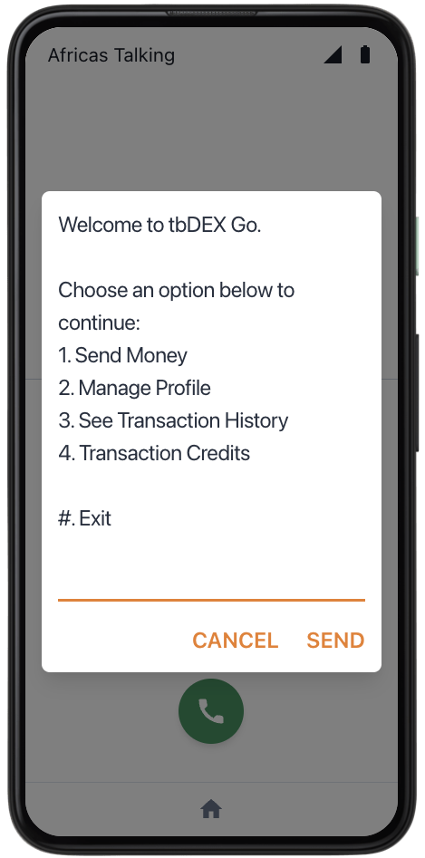
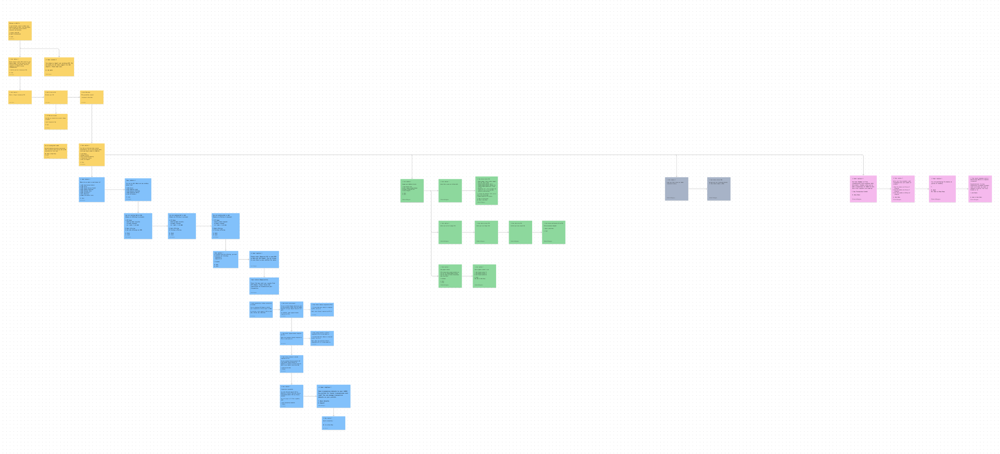

# tbDEX Go

Traveler on the go stranded in another country without internet access? Pay for your taxi, lunch and more with tbDEX Go.

## Overview

tbDEX Go is a mobile application that allows users to send money across currencies without internet access. It is powered by tbDex, a decentralized exchange protocol that allows for peer-to-peer financial transactions without intermediaries.

tbDEX Go is accessible via USSD (Unstructured Supplementary Service Data), a GSM protocol that is used to send and receive messages from mobile phones without using the internet.

Using USSD allows tbDEX Go to be accessible to our target market of travelers who frequently upon landing in new locations have limited or no internet access but have easy access to a mobile phone and need to send and receive money.

With access to any GSM/LTE network, even when roaming, users can send and receive money to/from local bank accounts. Travelers receive the best exchange rates for quick transactions at low to no fees.

## Try it out

You can try out the tbDEX Go USSD service visiting this [USSD Simulator](https://developers.africastalking.com/simulator).

Provide any valid phone number (does not have to be your real number for this demo) and click "Connect". You will now be able to simulate making USSD requests from that number.

Dial `*384*05040#` from the "Phone" app to then access the tbDEX Go USSD service.

## Technical Overview

tbDEX Go is built to work on Cloudflare Workers.

Requests to the tbDEX Go USSD service are routed to a Cloudflare Worker via the AfricasTalking USSD gateway. The worker handles the request, processes the transaction, and sends the response back to the AfricasTalking USSD gateway which then delivers it to the user's mobile phone.

We create DIDs for users, associated with their phone numbers and store them in a key manager. We interact with the tbDEX network on behalf of users with the aforementioned DIDs to send RFQ's, place orders and more.

We use SMS powered by AfricasTalking to send notifications to users. These SMS communications are bi-directional and allow users to do things like complete orders and rate PFI's outside of the USSD flow.

### Stack

- [Cloudflare Workers (with KV and D1)](https://developers.cloudflare.com/workers/)
- [tbDEX](https://github.com/tbdex/tbdex)
- [AfricasTalking (SMS and USSD provider)](https://africastalking.com/)
- [TypeScript](https://www.typescriptlang.org/)

## UX Overview

<a href='https://www.figma.com/board/c577KEhnqs6hIV4pEDo73F/tbDEX-GO-User-Flow?node-id=0-1&node-type=canvas&t=SFKh7ZPE54XCMT2f-0'>tbDEX Go UX Flow</a>

## Future Roadmap

- [ ] DID Imports and Exports
- [ ] More advanced PFI rating and weighting
